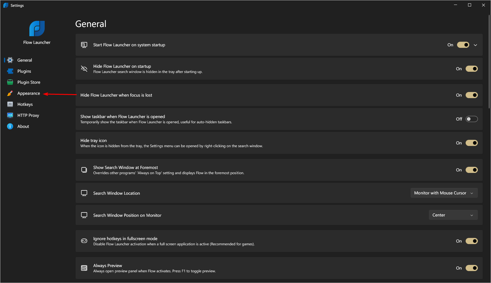
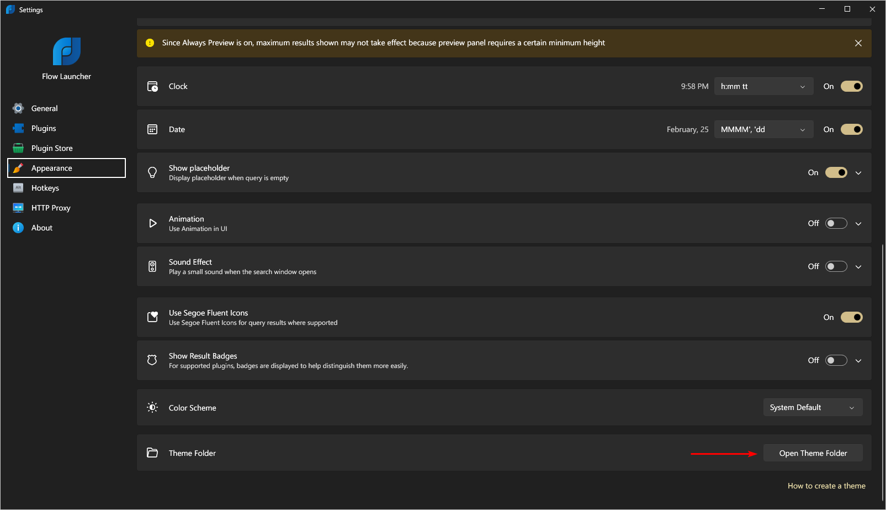
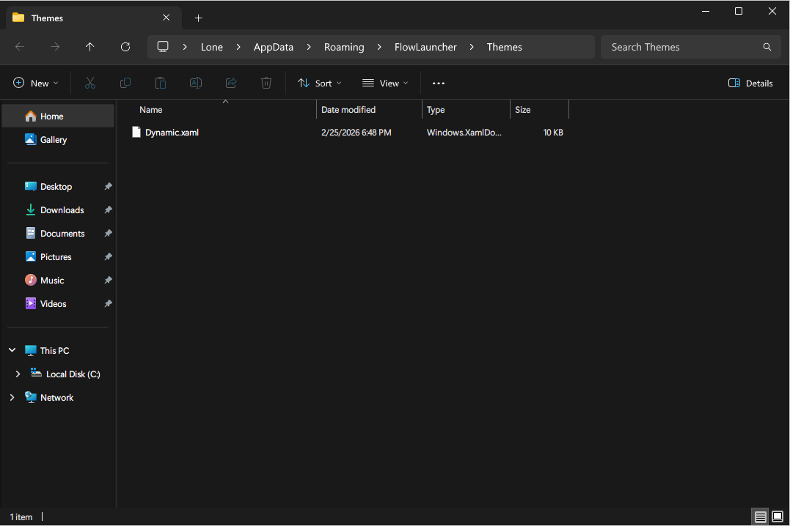
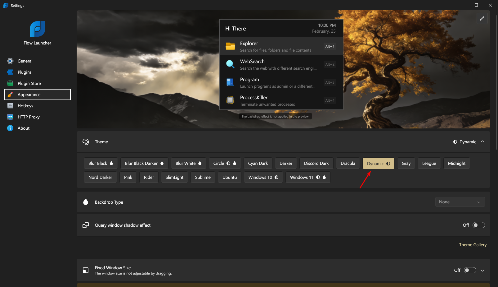
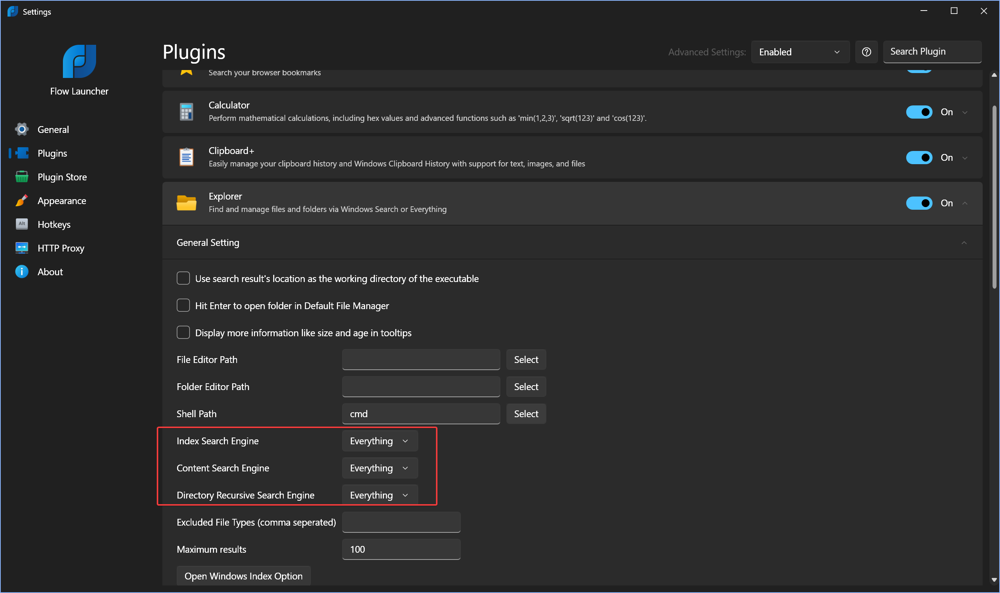

Use this page for Flow Launcher items that are easier to set manually.

#### Flow Launcher

For an optimal search, make changes to the following plugins

- Program - Index Sources: Tick `UWP Apps`, `Start Menu`, `Registry`; Options: Tick `Hide App Path`, `Hide Uninstallers`, `Hide Duplicated Apps`

Recommended Plugins

- AnyVideo Downloader
- Clipboard+ - Change action to cb
- Temp Cleaner d
- Windows Terminal Profiles

To apply the theme, navigate to `FlowLauncher` directory where it contains the necessary steps documented as images.

Need to also change index search to Everything!

