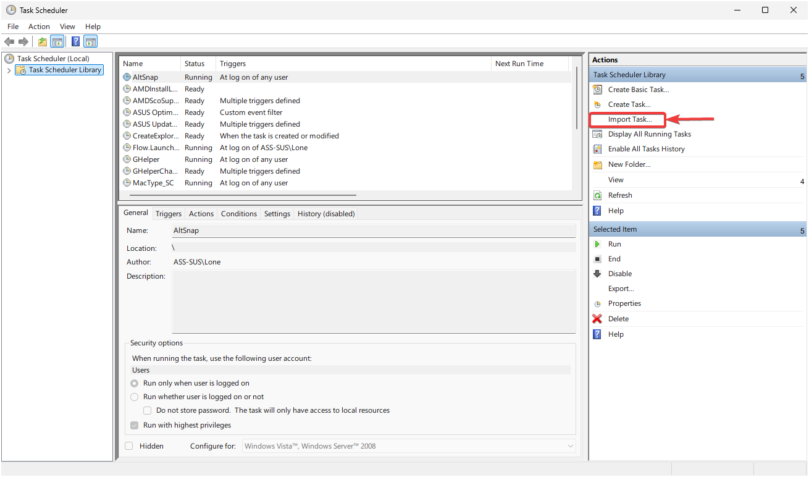
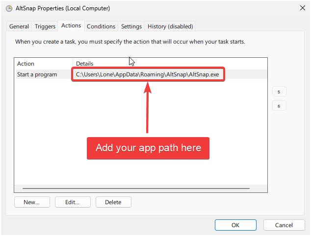

Use this folder for exported scheduled task XML files that launch tooling on logon.

Suggested exports:

- `komorebi.xml`
- `yasb.xml`
- `glazewm.xml` (if you are using GlazeWM on a machine)
- `flow-launcher.xml`

## MANUAL Starting GlazeWM and AltSnap at Logon

To automatically start GlazeWM and AltSnap when you log in to Windows, create two scheduled tasks using Task Scheduler.

### Step 1: Open Task Scheduler

1. Press `Win + R`, type `taskschd.msc`, and press Enter
2. In the right panel, click **"Create Task..."** (not "Create Basic Task")

### Step 2: General Settings

1. **Name**: `GlazeWM Startup`
2. **Description**: `Starts GlazeWM with system tray`
3. Check **"Run only when user is logged on"**
4. Check **"Run with highest privileges"**
5. Configure **"Configure for"**: `Windows 10` or `Windows 11`

### Step 3: Triggers Tab

1. Click **"New..."**
2. **Begin the task**: `At log on`
3. **Settings**: `Any user`
4. Click **OK**

### Step 4: Actions Tab

1. Click **"New..."**
2. **Action**: `Start a program`
3. **Program/script**: Click **"Browse..."** and navigate to the GlazeWM executable:
4. **Add arguments**: `--tray`
5. Click **OK**

### Step 5: Create AltSnap Task

Repeat Steps 1-4 with these differences:

- **Name**: `AltSnap Startup`
- **Description**: `Starts AltSnap with system tray`
- **Program/script**: Browse to the AltSnap executable:
- **Add arguments**: `--tray`
