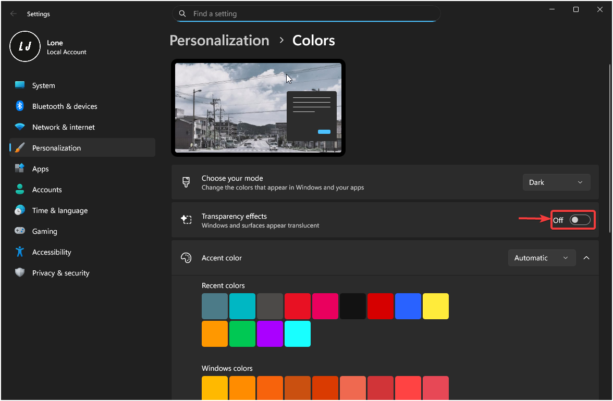
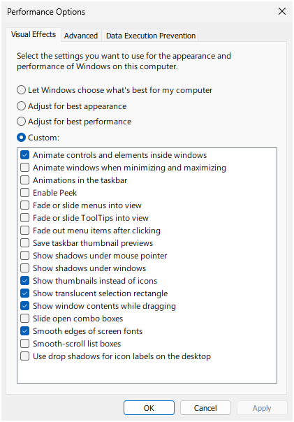
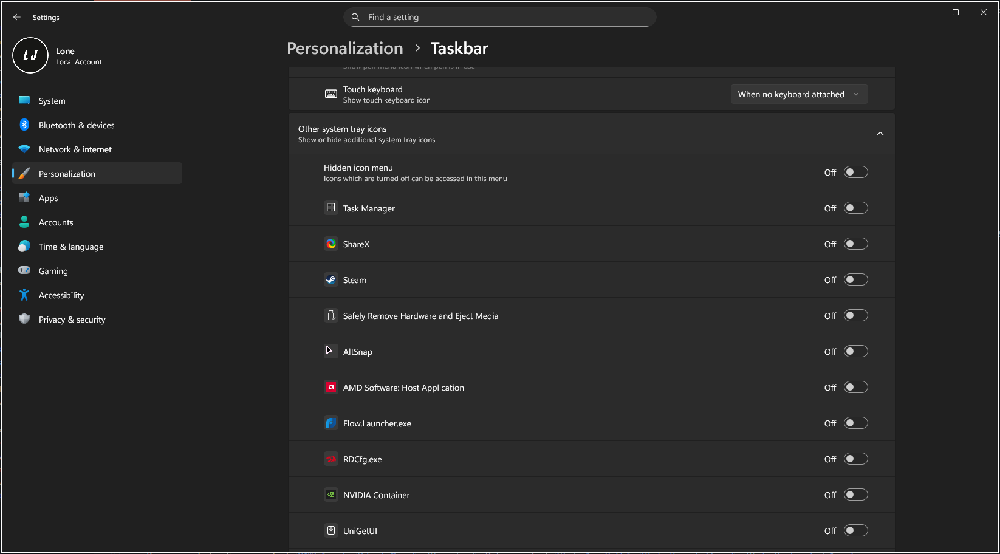

Use this page for manual Windows UI and system settings that are not directly managed as dotfiles.

Suggested checklist:

- Transparency effects on/off preference.
- Performance mode and animation preferences.
- Notification tray and system icon visibility.
- Taskbar behavior (multi-monitor, alignment, auto-hide).
